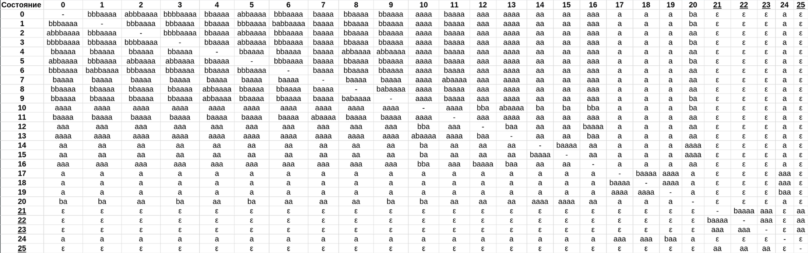
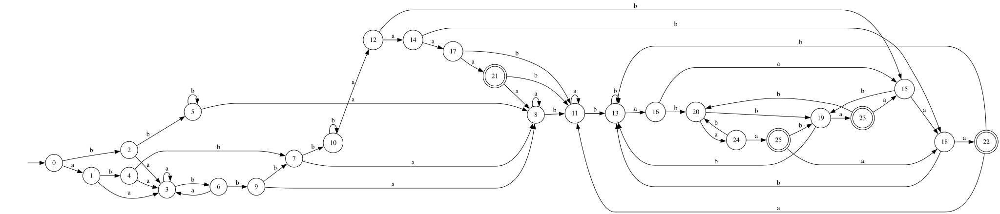
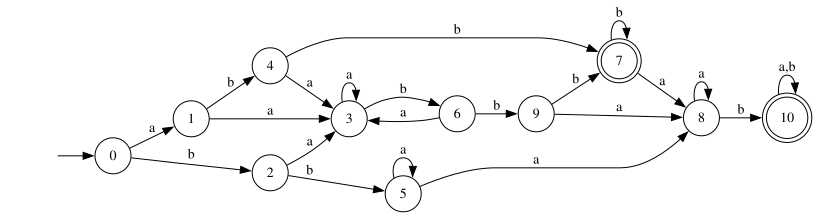
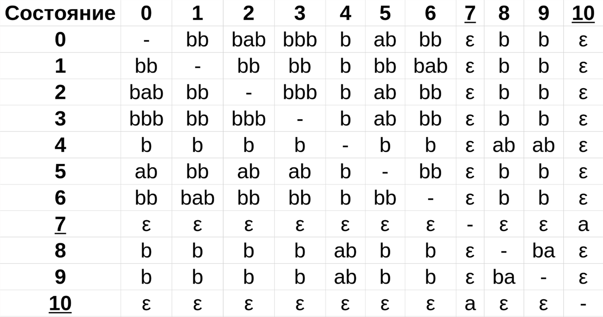
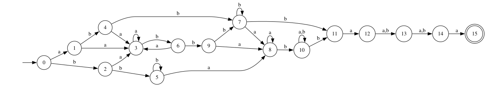
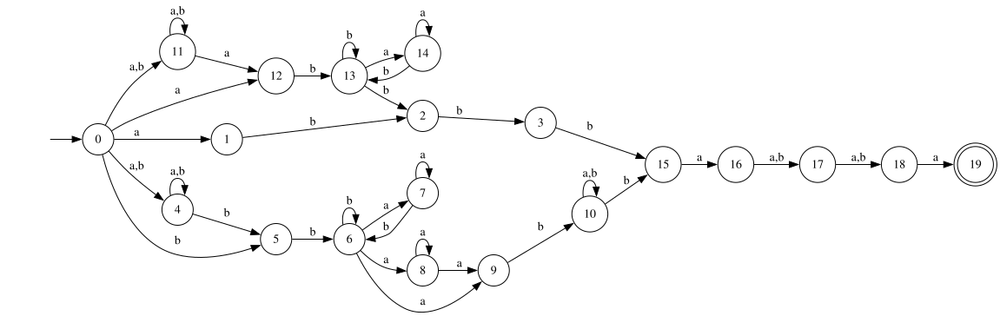
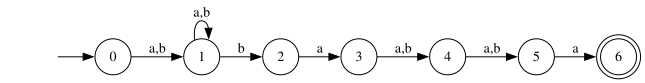
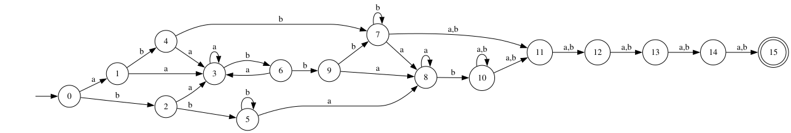
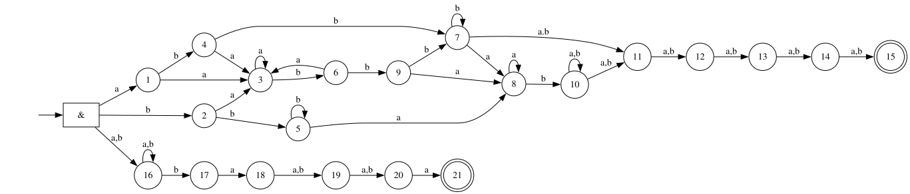

# Лабораторная работа №2 (Вариант 25).

Тверитнев Михаил, ИУ9-51Б.

# 0. Исходное регулярное выражение.

```
((a|b)*bb(a*b)*a*ab(a|b)*|abb|(a|b)*ab(a*b)*bb)ba(a|b)(a|b)a
```

# 1. Построение минимального ДКА.

Вычислим follow_pos (позиции символов в регулярке, которые могут появиться сразу после отмеченного символа) для каждого символа линеаризованного регулярного выражения:

| Символ             | follow_pos               |
|--------------------|--------------------------|
| $\text{a}_1$       | $\lbrace1,2,3\rbrace$    |
| $\text{b}_2$       | $\lbrace1,2,3\rbrace$    |
| $\text{b}_3$       | $\lbrace4\rbrace$        |
| $\text{b}_4$       | $\lbrace5,6,7,8\rbrace$  |
| $\text{a}_5$       | $\lbrace5,6\rbrace$      |
| $\text{b}_6$       | $\lbrace5,6,7,8\rbrace$  |
| $\text{a}_7$       | $\lbrace7,8\rbrace$      |
| $\text{a}_8$       | $\lbrace9\rbrace$        |
| $\text{b}_9$       | $\lbrace10,11,23\rbrace$ |
| $\text{a}_{10}$    | $\lbrace10,11,23\rbrace$ |
| $\text{b}_{11}$    | $\lbrace10,11,23\rbrace$ |
| $\text{a}_{12}$    | $\lbrace13\rbrace$       |
| $\text{b}_{13}$    | $\lbrace14\rbrace$       |
| $\text{b}_{14}$    | $\lbrace23\rbrace$       |
| $\text{a}_{15}$    | $\lbrace15,16,17\rbrace$ |
| $\text{b}_{16}$    | $\lbrace15,16,17\rbrace$ |
| $\text{a}_{17}$    | $\lbrace18\rbrace$       |
| $\text{b}_{18}$    | $\lbrace19,20,21\rbrace$ |
| $\text{a}_{19}$    | $\lbrace19,20\rbrace$    |
| $\text{b}_{20}$    | $\lbrace19,20,21\rbrace$ |
| $\text{b}_{21}$    | $\lbrace22\rbrace$       |
| $\text{b}_{22}$    | $\lbrace23\rbrace$       |
| $\text{b}_{23}$    | $\lbrace24\rbrace$       |
| $\text{a}_{24}$    | $\lbrace25,26\rbrace$    |
| $\text{a}_{25}$    | $\lbrace27,28\rbrace$    |
| $\text{b}_{26}$    | $\lbrace27,28\rbrace$    |
| $\text{a}_{27}$    | $\lbrace29\rbrace$       |
| $\text{b}_{28}$    | $\lbrace29\rbrace$       |
| $\text{a}_{29}$    | $\lbrace30\rbrace$       |
| $`\text{\#}_{30}`$ | -                        |

Первыми могут быть символы на следующих позициях: $\lbrace1,2,3,12,15,16,17\rbrace$. Это и будет начальное состояние $\text{S}_0$.

Получаем следующую таблицу переходов:

| Состояние                                                                                       | a                           | b               |
|-------------------------------------------------------------------------------------------------|-----------------------------|-----------------|
| $\text{S}_0 = \lbrace1,2,3,12,15,16,17\rbrace$                                                  | $\text{S}_1$                | $\text{S}_2$    |
| $\text{S}_1 = \lbrace1,2,3,13,15,16,17,18\rbrace$                                               | $\text{S}_3$                | $\text{S}_4$    |
| $\text{S}_2 = \lbrace1,2,3,4,15,16,17\rbrace$                                                   | $\text{S}_3$                | $\text{S}_5$    |
| $\text{S}_3 = \lbrace1,2,3,15,16,17,18\rbrace$                                                  | $\text{S}_3$                | $\text{S}_6$    |
| $\text{S}_4 = \lbrace1,2,3,4,14,15,16,17,19,20,21\rbrace$                                       | $\text{S}_7$                | $\text{S}_8$    |
| $\text{S}_5 = \lbrace1,2,3,4,5,6,7,8,15,16,17\rbrace$                                           | $\text{S}_9$                | $\text{S}_5$    |
| $\text{S}_6 = \lbrace1,2,3,4,15,16,17,19,20,21\rbrace$                                          | $\text{S}_7$                | $\text{S}_{10}$ |
| $\text{S}_7 = \lbrace1,2,3,15,16,17,18,19,20\rbrace$                                            | $\text{S}_7$                | $\text{S}_6$    |
| $\text{S}_8 = \lbrace1,2,3,4,5,6,7,8,15,16,17,19,20,21,22,23\rbrace$                            | $\text{S}_{11}$             | $\text{S}_{12}$ |
| $\text{S}_9 = \lbrace1,2,3,5,6,7,8,9,15,16,17,18\rbrace$                                        | $\text{S}_9$                | $\text{S}_{13}$ |
| $\text{S}_{10} = \lbrace1,2,3,4,5,6,7,8,15,16,17,19,20,21,22\rbrace$                            | $\text{S}_{11}$             | $\text{S}_8$    |
| $\text{S}_{11} = \lbrace1,2,3,5,6,7,8,9,15,16,17,18,19,20\rbrace$                               | $\text{S}_{11}$             | $\text{S}_{13}$ |
| $\text{S}_{12} = \lbrace1,2,3,4,5,6,7,8,15,16,17,19,20,21,22,23,24\rbrace$                      | $\text{S}_{14}$             | $\text{S}_{12}$ |
| $\text{S}_{13} = \lbrace1,2,3,4,5,6,7,8,10,11,15,16,17,19,20,21,23\rbrace$                      | $\text{S}_{15}$             | $\text{S}_{16}$ |
| $\text{S}_{14} = \lbrace1,2,3,5,6,7,8,9,15,16,17,18,19,20,25,26\rbrace$                         | $\text{S}_{17}$             | $\text{S}_{18}$ |
| $\text{S}_{15} = \lbrace1,2,3,5,6,7,8,9,10,11,15,16,17,18,19,20,23\rbrace$                      | $\text{S}_{15}$             | $\text{S}_{19}$ |
| $\text{S}_{16} = \lbrace1,2,3,4,5,6,7,8,10,11,15,16,17,19,20,21,22,23,24\rbrace$                | $\text{S}_{20}$             | $\text{S}_{16}$ |
| $\text{S}_{17} = \lbrace1,2,3,5,6,7,8,9,15,16,17,18,19,20,27,28\rbrace$                         | $\text{S}_{21}$             | $\text{S}_{22}$ |
| $\text{S}_{18} = \lbrace1,2,3,4,5,6,7,8,10,11,15,16,17,19,20,21,23,27,28\rbrace$                | $\text{S}_{23}$             | $\text{S}_{24}$ |
| $\text{S}_{19} = \lbrace1,2,3,4,5,6,7,8,10,11,15,16,17,19,20,21,23,24\rbrace$                   | $\text{S}_{20}$             | $\text{S}_{16}$ |
| $\text{S}_{20} = \lbrace1,2,3,5,6,7,8,9,10,11,15,16,17,18,19,20,23,25,26\rbrace$                | $\text{S}_{25}$             | $\text{S}_{26}$ |
| $\text{S}_{21} = \lbrace1,2,3,5,6,7,8,9,15,16,17,18,19,20,29\rbrace$                            | $\underline{\text{S}_{27}}$ | $\text{S}_{13}$ |
| $\text{S}_{22} = \lbrace1,2,3,4,5,6,7,8,10,11,15,16,17,19,20,21,23,29\rbrace$                   | $\underline{\text{S}_{28}}$ | $\text{S}_{16}$ |
| $\text{S}_{23} = \lbrace1,2,3,5,6,7,8,9,10,11,15,16,17,18,19,20,23,29\rbrace$                   | $\underline{\text{S}_{28}}$ | $\text{S}_{19}$ |
| $\text{S}_{24} = \lbrace1,2,3,4,5,6,7,8,10,11,15,16,17,19,20,21,22,23,24,29\rbrace$             | $\underline{\text{S}_{29}}$ | $\text{S}_{16}$ |
| $\text{S}_{25} = \lbrace1,2,3,5,6,7,8,9,10,11,15,16,17,18,19,20,23,27,28\rbrace$                | $\text{S}_{23}$             | $\text{S}_{30}$ |
| $\text{S}_{26} = \lbrace1,2,3,4,5,6,7,8,10,11,15,16,17,19,20,21,23,24,27,28\rbrace$             | $\text{S}_{31}$             | $\text{S}_{24}$ |
| $\underline{\text{S}_{27}} = \lbrace1,2,3,5,6,7,8,9,15,16,17,18,19,20,30\rbrace$                | $\text{S}_{11}$             | $\text{S}_{13}$ |
| $\underline{\text{S}_{28}} = \lbrace1,2,3,5,6,7,8,9,10,11,15,16,17,18,19,20,23,30\rbrace$       | $\text{S}_{15}$             | $\text{S}_{19}$ |
| $\underline{\text{S}_{29}} = \lbrace1,2,3,5,6,7,8,9,10,11,15,16,17,18,19,20,23,25,26,30\rbrace$ | $\text{S}_{25}$             | $\text{S}_{26}$ |
| $\text{S}_{30} = \lbrace1,2,3,4,5,6,7,8,10,11,15,16,17,19,20,21,23,24,29\rbrace$                | $\underline{\text{S}_{29}}$ | $\text{S}_{16}$ |
| $\text{S}_{31} = \lbrace1,2,3,5,6,7,8,9,10,11,15,16,17,18,19,20,23,25,26,29\rbrace$             | $\underline{\text{S}_{32}}$ | $\text{S}_{26}$ |
| $\underline{\text{S}_{32}} = \lbrace1,2,3,5,6,7,8,9,10,11,15,16,17,18,19,20,23,27,28,30\rbrace$ | $\text{S}_{23}$             | $\text{S}_{30}$ |


Минимизируем автомат.

- Состояния 16 и 19 переходят в одинаковые состояния по символам a и b $`\rightarrow`$ они находятся в одном классе эквивалентности $`\lbrace \text{S}_{16}, \text{S}_{19} \rbrace = \text{S}_{16-19}`$;
- Состояния 13 и 15 переходят в одинаковое состояние по символу a, а по b переходят в состояния из одного класса эквивалентности $`\text{S}_{16-19} \rightarrow`$ состояния 13 и 15 находятся в одном классе эквивалентности $`\lbrace \text{S}_{13}, \text{S}_{15}\rbrace = \text{S}_{13-15}`$;
- Состояния 24 и 30 переходят в одинаковые состояния по символам a и b $`\rightarrow`$ они находятся в одном классе эквивалентности $`\lbrace \text{S}_{24}, \text{S}_{30}\rbrace = \text{S}_{24-30}`$;
- Состояния 18 и 25 переходят в одинаковое состояние по символу a, а по b переходят в состояния из одного класса эквивалентности $`\text{S}_{24-30}`$ $`\rightarrow`$ состояния 18 и 25 находятся в одном классе эквивалентности $`\lbrace \text{S}_{18}, \text{S}_{25}\rbrace = \text{S}_{18-25}`$;
- Состояния 22 и 23 переходят в одинаковое состояние по символу a, а по b переходят в состояния из одного класса эквивалентности $`\text{S}_{16-19}`$ $`\rightarrow`$ состояния 22 и 23 находятся в одном классе эквивалентности $`\lbrace \text{S}_{22}, \text{S}_{23}\rbrace = \text{S}_{22-23}`$;
- Состояния 9 и 11 переходят в себя по символу a и имеют одинаковый переход по символу b $`\rightarrow`$ состояния 9 и 11 находятся в одном классе эквивалентности $`\lbrace \text{S}_{9}, \text{S}_{11}\rbrace = \text{S}_{9-11}`$;
- Состояния 3 и 7 переходят в себя по символу a и имеют одинаковый переход по символу b $`\rightarrow`$ состояния 3 и 7 находятся в одном классе эквивалентности $`\lbrace \text{S}_{3}, \text{S}_{7}\rbrace = \text{S}_{3-7}`$;


| Состояние                          | a                           | b                  | Слово, по которому достижимо состояние |
|------------------------------------|-----------------------------|--------------------|----------------------------------------|
| $\text{S}_0 \to 0$                 | $\text{S}_1$                | $\text{S}_2$       | $\varepsilon$                          |
| $\text{S}_1 \to 1$                 | $\text{S}_{3-7}$            | $\text{S}_4$       | $\text{a}$                             |
| $\text{S}_2 \to 2$                 | $\text{S}_{3-7}$            | $\text{S}_5$       | $\text{b}$                             |
| $\text{S}_{3-7} \to 3$             | $\text{S}_{3-7}$            | $\text{S}_6$       | $\text{aa}$                            |
| $\text{S}_4 \to 4$                 | $\text{S}_{3-7}$            | $\text{S}_8$       | $\text{ab}$                            |
| $\text{S}_5 \to 5$                 | $\text{S}_{9-11}$           | $\text{S}_5$       | $\text{bb}$                            |
| $\text{S}_6 \to 6$                 | $\text{S}_{3-7}$            | $\text{S}_{10}$    | $\text{bab}$                           |
| $\text{S}_8 \to 7$                 | $\text{S}_{9-11}$           | $\text{S}_{12}$    | $\text{abb}$                           |
| $\text{S}_{9-11} \to 8$            | $\text{S}_{9-11}$           | $\text{S}_{13-15}$ | $\text{bba}$                           |
| $\text{S}_{10} \to 9$              | $\text{S}_{9-11}$           | $\text{S}_8$       | $\text{babb}$                          |
| $\text{S}_{12} \to 10$             | $\text{S}_{14}$             | $\text{S}_{12}$    | $\text{abbb}$                          |
| $\text{S}_{13-15} \to 11$          | $\text{S}_{13-15}$          | $\text{S}_{16-19}$ | $\text{bbab}$                          |
| $\text{S}_{14} \to 12$             | $\text{S}_{17}$             | $\text{S}_{18-25}$ | $\text{abbba}$                         |
| $\text{S}_{16-19} \to 13$          | $\text{S}_{20}$             | $\text{S}_{16-19}$ | $\text{bbabb}$                         |
| $\text{S}_{17} \to 14$             | $\text{S}_{21}$             | $\text{S}_{22-23}$ | $\text{abbbaa}$                        |
| $\text{S}_{18-25} \to 15$          | $\text{S}_{22-23}$          | $\text{S}_{24-30}$ | $\text{abbbab}$                        |
| $\text{S}_{20} \to 16$             | $\text{S}_{18-25}$          | $\text{S}_{26}$    | $\text{bbabba}$                        |
| $\text{S}_{21} \to 17$             | $\underline{\text{S}_{27}}$ | $\text{S}_{13-15}$ | $\text{abbbaaa}$                       |
| $\text{S}_{22-23} \to 18$          | $\underline{\text{S}_{28}}$ | $\text{S}_{16-19}$ | $\text{abbbaab}$                       |
| $\text{S}_{24-30} \to 19$          | $\underline{\text{S}_{29}}$ | $\text{S}_{16-19}$ | $\text{abbbabbb}$                      |
| $\text{S}_{26 \to 20}$             | $\text{S}_{31}$             | $\text{S}_{24-30}$ | $\text{bbabbab}$                       |
| $\underline{\text{S}_{27}} \to 21$ | $\text{S}_{9-11}$           | $\text{S}_{13-15}$ | $\text{abbbaaaa}$                      |
| $\underline{\text{S}_{28}} \to 22$ | $\text{S}_{13-15}$          | $\text{S}_{16-19}$ | $\text{abbbabaa}$                      |
| $\underline{\text{S}_{29}} \to 23$ | $\text{S}_{18-25}$          | $\text{S}_{26}$    | $\text{abbbabbba}$                     |
| $\text{S}_{31} \to 24$             | $\underline{\text{S}_{32}}$ | $\text{S}_{26}$    | $\text{bbabbaba}$                      |
| $\underline{\text{S}_{32}} \to 25$ | $\text{S}_{22-23}$          | $\text{S}_{24-30}$ | $\text{bbabbabaa}$                     |

Каждое состояние автомата достижимо из стартового.

Покажем, что никакие два класса эквивалентности более нельзя объединить и каждое состояние является отдельным классом эквивалентности.

Построим (симметричную) таблицу состояний (с помощью программы `equiv_builder.rs`), где в каждой ячейке - различающая строка (из состояния, представленного столбцом по ней можно перейти в финальное, из другого состояния, представленного строкой - нельзя). 



В результате построения таблицы классов эквивалентности показано, что в ДКА нет эквивалентных состояний, следовательно, он минимальный (всего **26** состояний).



# 2. Получение малого НКА.

Поскольку у всех слов из языка есть общий суффикс (`ba(a|b)(a|b)a`), начинающийся с фиксированного символа `b`, префикс имеет общие части `(a*b)*` и `(a|b)*`, а линейная длина его альтернаций невелика (11 для самого длинного блока `(a|b)*bb(a*b)*a*ab(a|b)*`), есть смысл построить минимальный ДКА для префикса и соединить недетерминированным переходом по `b` с тривиальным ДКА для суффикса:

 для суффикса")

Построение минимального ДКА для префикса аналогично случаю с полным регулярным выражением.

| Символ             | follow_pos               |
|--------------------|--------------------------|
| $\text{a}_1$       | $\lbrace1,2,3\rbrace$    |
| $\text{b}_2$       | $\lbrace1,2,3\rbrace$    |
| $\text{b}_3$       | $\lbrace4\rbrace$        |
| $\text{b}_4$       | $\lbrace5,6,7,8\rbrace$  |
| $\text{a}_5$       | $\lbrace5,6\rbrace$      |
| $\text{b}_6$       | $\lbrace5,6,7,8\rbrace$  |
| $\text{a}_7$       | $\lbrace7,8\rbrace$      |
| $\text{a}_8$       | $\lbrace9\rbrace$        |
| $\text{b}_9$       | $\lbrace10,11,23\rbrace$ |
| $\text{a}_{10}$    | $\lbrace10,11,23\rbrace$ |
| $\text{b}_{11}$    | $\lbrace10,11,23\rbrace$ |
| $\text{a}_{12}$    | $\lbrace13\rbrace$       |
| $\text{b}_{13}$    | $\lbrace14\rbrace$       |
| $\text{b}_{14}$    | $\lbrace23\rbrace$       |
| $\text{a}_{15}$    | $\lbrace15,16,17\rbrace$ |
| $\text{b}_{16}$    | $\lbrace15,16,17\rbrace$ |
| $\text{a}_{17}$    | $\lbrace18\rbrace$       |
| $\text{b}_{18}$    | $\lbrace19,20,21\rbrace$ |
| $\text{a}_{19}$    | $\lbrace19,20\rbrace$    |
| $\text{b}_{20}$    | $\lbrace19,20,21\rbrace$ |
| $\text{b}_{21}$    | $\lbrace22\rbrace$       |
| $\text{b}_{22}$    | $\lbrace23\rbrace$       |
| $`\text{\#}_{23}`$ | -                        |

Начальное состояние то же, что и при построении автомата для полного регулярного выражения.

| Состояние                                                                                 | a                           | b                           |
|-------------------------------------------------------------------------------------------|-----------------------------|-----------------------------|
| $\text{S}_0 = \lbrace1,2,3,12,15,16,17\rbrace$                                            | $\text{S}_1$                | $\text{S}_2$                |
| $\text{S}_1 = \lbrace1,2,3,13,15,16,17,18\rbrace$                                         | $\text{S}_3$                | $\text{S}_4$                |
| $\text{S}_2 = \lbrace1,2,3,4,15,16,17\rbrace$                                             | $\text{S}_3$                | $\text{S}_5$                |
| $\text{S}_3 = \lbrace1,2,3,15,16,17,18\rbrace$                                            | $\text{S}_3$                | $\text{S}_6$                |
| $\text{S}_4 = \lbrace1,2,3,4,14,15,16,17,19,20,21\rbrace$                                 | $\text{S}_7$                | $\underline{\text{S}_8}$    |
| $\text{S}_5 = \lbrace1,2,3,4,5,6,7,8,15,16,17\rbrace$                                     | $\text{S}_9$                | $\text{S}_5$                |
| $\text{S}_6 = \lbrace1,2,3,4,15,16,17,19,20,21\rbrace$                                    | $\text{S}_7$                | $\text{S}_{10}$             |
| $\text{S}_7 = \lbrace1,2,3,15,16,17,18,19,20\rbrace$                                      | $\text{S}_7$                | $\text{S}_6$                |
| $\underline{\text{S}_8} = \lbrace1,2,3,4,5,6,7,8,15,16,17,19,20,21,22,23\rbrace$          | $\text{S}_{11}$             | $\underline{\text{S}_8}$    |
| $\text{S}_9 = \lbrace1,2,3,5,6,7,8,9,15,16,17,18\rbrace$                                  | $\text{S}_9$                | $\underline{\text{S}_{12}}$ |
| $\text{S}_{10} = \lbrace1,2,3,4,5,6,7,8,15,16,17,19,20,21,22\rbrace$                      | $\text{S}_{11}$             | $\underline{\text{S}_8}$    |
| $\text{S}_{11} = \lbrace1,2,3,5,6,7,8,9,15,16,17,18,19,20\rbrace$                         | $\text{S}_{11}$             | $\underline{\text{S}_{12}}$ |
| $\underline{\text{S}_{12}} = \lbrace1,2,3,4,5,6,7,8,10,11,15,16,17,19,20,21,23\rbrace$    | $\underline{\text{S}_{13}}$ | $\underline{\text{S}_{14}}$ |
| $\underline{\text{S}_{13}} = \lbrace1,2,3,5,6,7,8,9,10,11,15,16,17,18,19,20,23\rbrace$    | $\underline{\text{S}_{13}}$ | $\underline{\text{S}_{12}}$ |
| $\underline{\text{S}_{14}} = \lbrace1,2,3,4,5,6,7,8,10,11,15,16,17,19,20,21,22,23\rbrace$ | $\underline{\text{S}_{13}}$ | $\underline{\text{S}_{14}}$ |

Минимизируем автомат.

- Состояния 12 и 14 переходят в одинаковые состояния по символам `a` и `b` $`\rightarrow`$ они находятся в одном классе эквивалентности $`\lbrace \text{S}_{12}, \text{S}_{14}\rbrace = \text{S}_{12-14}`$;
- Состояния 3 и 7 переходят в себя по символу `a` и имеют одинаковый переход по символу `b` $`\rightarrow`$ состояния 3 и 7 находятся в одном классе эквивалентности $`\lbrace \text{S}_{3}, \text{S}_{7}\rbrace = \text{S}_{3-7}`$;
- Состояния 9 и 11 переходят в себя по символу `a` и имеют одинаковый переход по символу `b` $`\rightarrow`$ состояния 9 и 11 находятся в одном классе эквивалентности $`\lbrace \text{S}_{9}, \text{S}_{11}\rbrace = \text{S}_{9-11}`$;
- Состояния 12-14 и 13 имеют одинаковый переход по символу `a` и переходят по `b` в эквивалентные состояния $`\rightarrow`$ они находятся в одном классе эквивалентности $`\lbrace \text{S}_{12-14}, \text{S}_{13}\rbrace = \text{S}_{12-13-14}`$;


| Состояние                                | a                                 | b                                 | Слово, по которому достижимо состояние |
|------------------------------------------|-----------------------------------|-----------------------------------|------------------------------|
| $\text{S}_0 \to 0$                       | $\text{S}_1$                      | $\text{S}_2$                      | $\varepsilon$                |
| $\text{S}_1 \to 1$                       | $\text{S}_{3-7}$                  | $\text{S}_4$                      | $\text{a}$                   |
| $\text{S}_2 \to 2$                       | $\text{S}_{3-7}$                  | $\text{S}_5$                      | $\text{b}$                   |
| $\text{S}_{3-7} \to 3$                   | $\text{S}_{3-7}$                  | $\text{S}_6$                      | $\text{ba}$                  |
| $\text{S}_4 \to 4$                       | $\text{S}_{3-7}$                  | $\underline{\text{S}_8}$          | $\text{ab}$                  |
| $\text{S}_5 \to 5$                       | $\text{S}_{9-11}$                 | $\text{S}_5$                      | $\text{bb}$                  |
| $\text{S}_6 \to 6$                       | $\text{S}_{3-7}$                  | $\text{S}_{10}$                   | $\text{bab}$                 |
| $\underline{\text{S}_8} \to 7$           | $\text{S}_{9-11}$                 | $\underline{\text{S}_8}$          | $\text{abb}$                 |
| $\text{S}_{9-11} \to 8$                  | $\text{S}_{9-11}$                 | $\underline{\text{S}_{12-13-14}}$ | $\text{bba}$                 |
| $\text{S}_{10} \to 9$                    | $\text{S}_{9-11}$                 | $\text{S}_8$                      | $\text{babb}$                |
| $\underline{\text{S}_{12-13-14}} \to 10$ | $\underline{\text{S}_{12-13-14}}$ | $\underline{\text{S}_{12-13-14}}$ | $\text{bbab}$                |




Покажем таблицей классов эквивалентности, что для префикса действительно построен минимальный ДКА:



Итоговый автомат будет иметь 11 + 5 = **16** состояний. 



Покажем, что недетерминированный переход от финальных состояний ДКА для префикса к стартовому состоянию ДКА для суффикса по символу `b` корректен и несократим.

$\lbrace 7, 10 \rbrace$ - финальные состояния автомата $M_P$ для префикса;
$\lbrace 11 \rbrace$ - стартовое состояние автомата $M_S$ для суффикса.

Корректность перехода от $\lbrace 7, 10 \rbrace$ к $\lbrace 11 \rbrace$ по символу `b` обусловлена тем, что суффикс всегда начинается с символа `b`, и среди всех путей для принимаемого слова есть случаи как с ранним, так и с корректным чтением суффикса, благодаря внутренним переходам по `b` из $\lbrace 7, 10 \rbrace$.

Заметим, что состояние 7 представляет "раннюю" финализацию префикса (варианты `abb` и `(a|b)*ab(a*b)*bb`, при конкатенации с `b*a+b` они сводятся к `(a|b)*bb(a*b)*a*ab(a|b)*` (состояние 10)). Префиксы, принимаемые состоянием 10, продолжают приниматься им при добавлении любого символа алфавита.

| Состояние               | a | b | Правый контекст |
|-------------------------|---|---|-----------------|
| $`7 \in M_P`$ | $`8 \in M_P`$ | $`7 \in M_P, 11 \in M_S`$  | $b^*a^+b(a \vert b)^*ba(a \vert b)(a \vert b)a \cup b^+a(a \vert b)(a \vert b)a$ |
| $`10 \in M_P`$ | $`10 \in M_P`$ | $`10 \in M_P, 11 \in M_S`$ | $(a \vert b)^*ba(a \vert b)(a \vert b)a$ |
| $`11 \in M_S`$    |$`12 \in M_S`$  |  - | $a(a \vert b)(a \vert b)a$ |

Продолжения финальных состояний для префикса различаются, соответственно, они не являются эквивалентными и сократить НКА их слиянием нельзя.

При построении НКА, например, алгоритмом Глушкова с удалением follow-эквивалентных состояний, различные варианты префиксов выделяются в отдельные ветви, происходит дублирование `(a*b)*` и длина автомата получается больше:



# 3. Построение ПКА.

У всех строк, которые входят в язык регулярного выражения, есть общий суффикс `ba(a|b)(a|b)a`. Автомат для него тривиальный (см. минимальный ДКА для суффикса из предыдущего раздела). Поскольку префикс гарантированно не пустой, переход к этой альтернативе возможен по любому символу, с недетерминированным циклом по любому символу в начальном состоянии альтернативы для поглощения префикса. Таким образом, автомат для суффикса распознаёт язык $`L_1 = (a|b)^+ \cdot S`$, где $`S = ba(a|b)(a|b)a`$.



| Префикс/суффикс | abaaaa | baaaa | aaaa | aaa | aa | a | ε |
|-----------------|--------|-------|------|-----|----|---|---|
| **ε**           | +      | -     | -    | -   | -  | - | - |
| **a**           | +      | +     | -    | -   | -  | - | - |
| **ab**          | +      | +     | +    | -   | -  | - | - |
| **aba**         | +      | +     | -    | +   | -  | - | - |
| **abaa**        | +      | +     | -    | -   | +  | - | - |
| **abaaa**       | +      | +     | -    | -   | -  | + | - |
| **abaaaa**      | +      | +     | -    | -   | -  | - | + |

Согласно теореме Глайстера-Шаллита, если существует N префиксов и N суффиксов таких, что вхождение их сочетаний образует диагональную или нижнетреугольную матрицу, то в НКА не меньше N состояний. Следовательно, НКА для $L_1$ минимальный.

Поскольку разрешённые префикс и суффикс могут перекрывать друг друга (например, `abbaaba`, `bbabaaba`; кроме случая, когда префикс `(a|b)*bb(a*b)*a*ab(a|b)*` заканчивается буквой `a`), для второго ветвления должны потребовать, чтобы оставалось ровно пять символов. Таким образом, другим ветвлением будет НКА для регулярного выражения, с той лишь разницей, что последние пять символов могут быть любыми. Данная ветвь распознаёт язык $`L_2 = P \cdot (a|b)^5`$, где $`P = ((a|b)^*bb(a^*b)^*a^*ab(a|b)^*|abb|(a|b)^*ab(a^*b)^*bb)`$.



Аналогично случаю с НКА для всего выражения, покажем, что недетерминированный переход от $\lbrace 7, 10 \rbrace$ к $\lbrace 11 \rbrace$ по символам $`a, b`$ несократим.

| Состояние               | a | b | Правый контекст |
|-------------------------|---|---|-----------------|
| $`7 \in M_P`$ | $`8 \in M_P, 11 \in M_{(a \vert b)^5}`$ | $`7 \in M_P, 11 \in M_{(a \vert b)^5}`$  | $`b^*a^+b(a \vert b)^*(a \vert b)^5 \cup b^*(a \vert b)^5`$ |
| $`10 \in M_P`$ | $`10 \in M_P, 11 \in M_{(a \vert b)^5}`$ | $`10 \in M_P, 11 \in M_{(a \vert b)^5}`$ | $(a \vert b)^*(a \vert b)^5$ |

Корректность построения ПКА из двух ветвей НКА доказывается следующим образом: 

Пусть $L' = L_1 \cap L_2$, $L_1$ = $(a|b)^+\cdot S$, $L_2$ = $P\cdot (a|b)^5$.

Для любого $w' \in L'$:

1) Из $w' \in L_1$ следует $w' = x \cdot v$, где $v \in S, |v| = 5$;
2) Из $w' \in L_2$ следует $w' = u \cdot y$, где $u \in P, |y| = 5$;
3) Из 1 и 2 следует $v = y \in S \rightarrow x = u \in P$.

Следовательно, любое слово $w' \in L \rightarrow L_1 \cap L_2 \subseteq L$. 

С другой стороны, $w = u \cdot v$, где $u \in P, v \in S$, для любого $w \in L$.
1) $w \in L_1$, поскольку: 
- $u \in (a|b)^+$, т.к. $|u| \ge 3 > 1$; 
- $v \in S$ по построению.
2) $w \in L_2$, поскольку: 
- $u \in P$ по построению; 
- $v \in (a|b)^5$, т.к. $|v| = 5$ для любого $v \in S$.
    
Следовательно, любое слово $w \in L_1 \cap L_2 \rightarrow L \subseteq L_1 \cap L_2$. 

Из двух включений и произвольности выбора слов $w$ и $w'$ следует $L_1 \cap L_2 = L$.

По построению, у обеих ветвей переход из стартового состояния по первому символу детерминированный $`\rightarrow`$ переход к альтернативам можно осуществить без $\varepsilon$-переходов.




# 4. Построение расширенного регулярного выражения.

Начинаем с исходного выражения, "обрамлённого" маркерами начала и конца строки:

```
^((a|b)*bb(a*b)*a*ab(a|b)*|abb|(a|b)*ab(a*b)*bb)ba(a|b)(a|b)a$
```

1) `a*a = a+`;
2) сократим регулярку с использованием нового синтаксиса.

```
^([ab]*bb(a*b)*a+b[ab]*|abb|[ab]*ab(a*b)*bb)ba[ab][ab]a$
```

Заметим, что все валидные строки содержат суффикс `ba[ab][ab]a`. Начнём расширенное регулярное выражение с lookahead, который принимает такой суффикс (можно даже потребовать префикс непустым): `(?=.+ba[ab][ab]a)$`.

Теперь отслеживаем префикс:

- `abb` оставляем отдельно;
- префикс `[ab]*` выносим отдельно для `[ab]*bb(a*b)*a+b[ab]*|[ab]*ab(a*b)*bb`;

Осталось поглотить ровно пять символов от суффикса, поскольку lookahead-ы не поглощают символов.

Получаем:

```
^(?=.+ba[ab][ab]a$)(abb|[ab]*(bb(a*b)*a+b[ab]*|ab(a*b)*bb)).....$
```

Если реализовывать тестирование при помощи встроенной библиотеки регулярных выражений, выражения в скобках лучше сделать незахватывающей группой для лучшей производительности (`(:? )` вместо `( )`), поскольку не требуется запоминать их содержимое.


